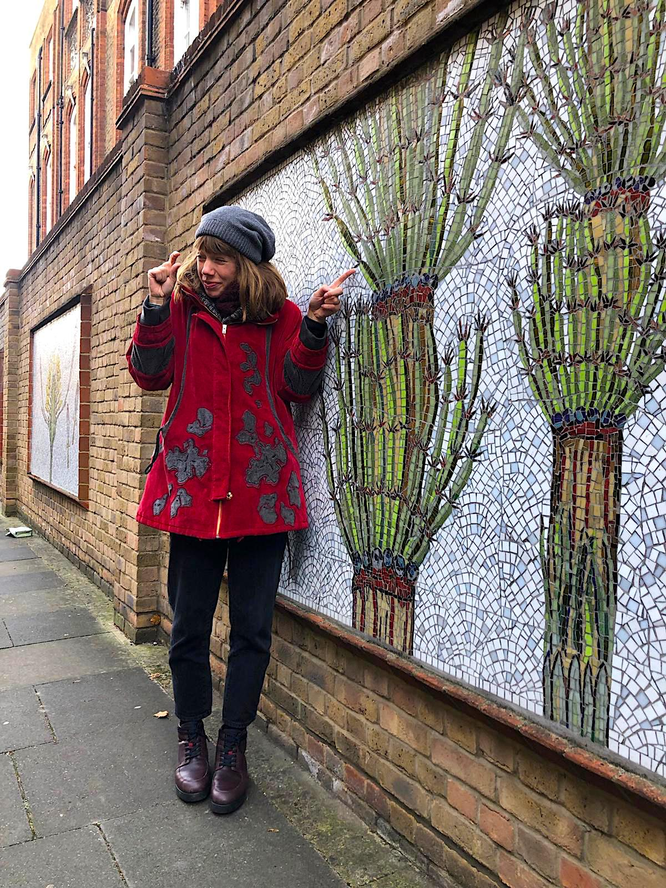

# Julia G. de Aledo

> PhD student at Universidad Autónoma de Madrid.

[Twitter](https://twitter.com/juliagdealedo)

[Tropical Ecology Lab](https://www.grupoecologiatropical.com)

## Research projects
- DISPLAMAZ
- DIVERCLADE
- BOTROPANDES

## Publications
- G. de Aledo, J., Bongers, F., Cayuela, L., & Macía, M. (2021). Connecting Indigenous and Scientific Ecological Knowledge in the Madidi National Park, Bolivia. Environmental Science Proceedings, 3, 7963. https://doi.org/10.3390/iecf2020-07963

## About me
I am interested in plant diversity, distribution, dominance and uses across latitudinal gradients in Western Amazonia.
